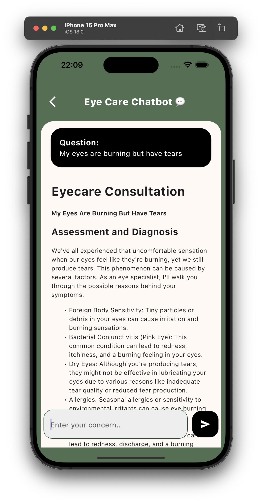
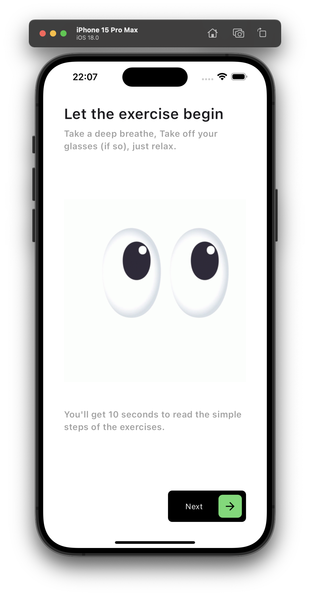

# Naani: Empowering Eye Health Through Technology


## Introduction

**Naani** is an innovative mobile application designed to empower individuals to take control of their eye health through simple and effective cataract detection. By leveraging advanced image classification technology, Naani offers an easy way to identify potential cataracts. The app also features a supportive chatbot powered by the Llama 3 API, providing personalized guidance, tips on eye care, and emotional support.

## Features

### 1. Cataract Detection
Naani uses state-of-the-art image classification technology to help users easily identify cataracts. Simply upload an image, and the app will analyze it for signs of cataracts.


### 2. Chatbot Support
Powered by the Llama 3 API, Naani's chatbot provides:
- Personalized guidance and support throughout the monitoring process
- Answers to frequently asked questions
- Tips on eye care and exercises
- Emotional support for users experiencing anxiety or concern about their eye health



### 3. Guided Eye Exercises
Naani includes a section dedicated to guided eye exercises, presented in an engaging format using GIFs. Exercises include:
- Blinking
- Palming
- Near and Far Focus
- Figure Eight
- Pencil Push-up
- Zooming
- Shifting Eyes
- The 20-20-20 Rule



## Getting Started

### Prerequisites
- [Flutter](https://flutter.dev/docs/get-started/install) installed on your machine
- [Ollama](https://ollama.com/) installed on your machine (Llama3 model)
- A device or emulator to run the app
- Make your own server API for image classfication and llama3

### Installation
1. Clone the repository:
   ```bash
   git clone https://github.com/your-username/naani.git
2. Navigate to the project directory:
   ```bash
   cd naani
3. Install dependencies:
   ```bash
   flutter pub get

### Running the App
Connect your device or start an emulator, then run:
   ```bash
   flutter pub get


